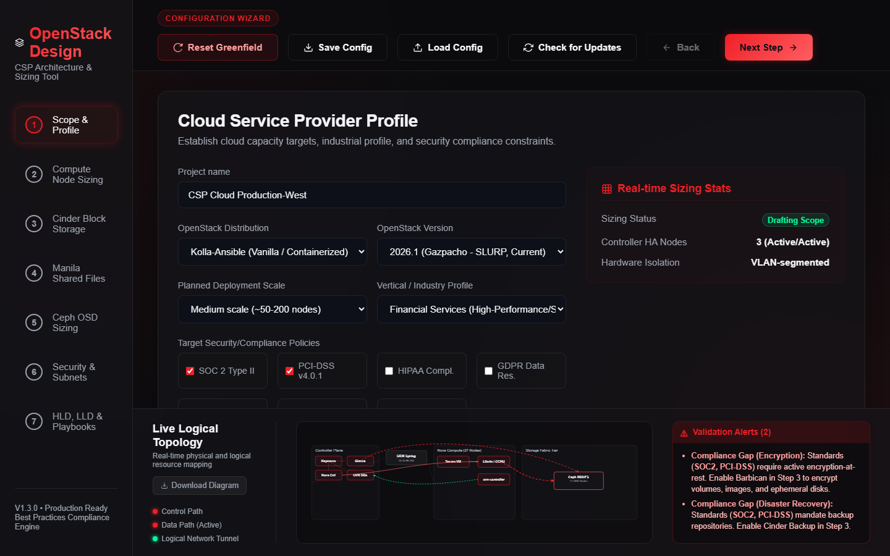
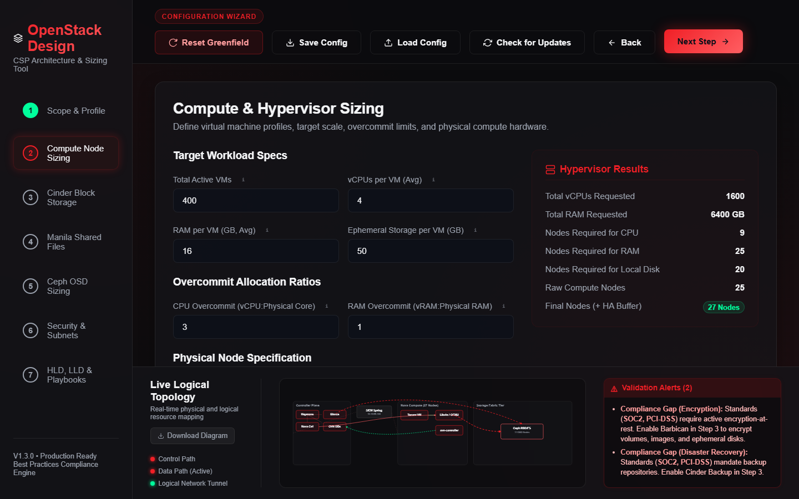
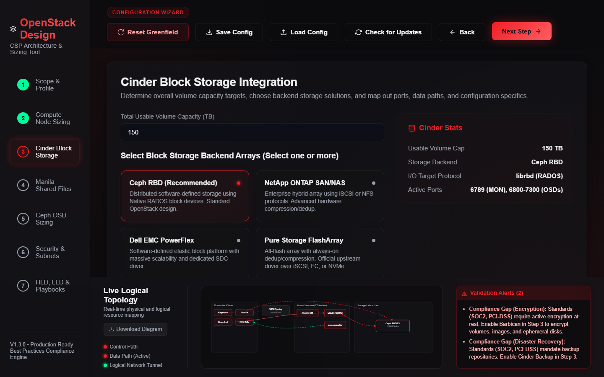
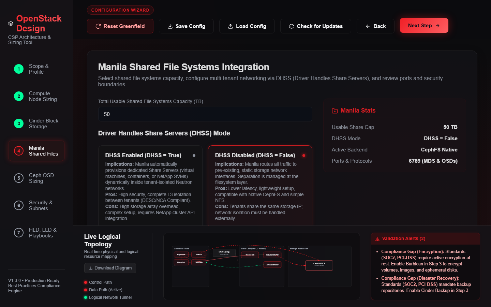
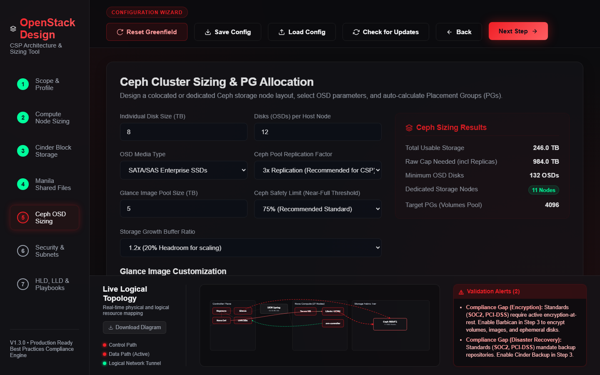
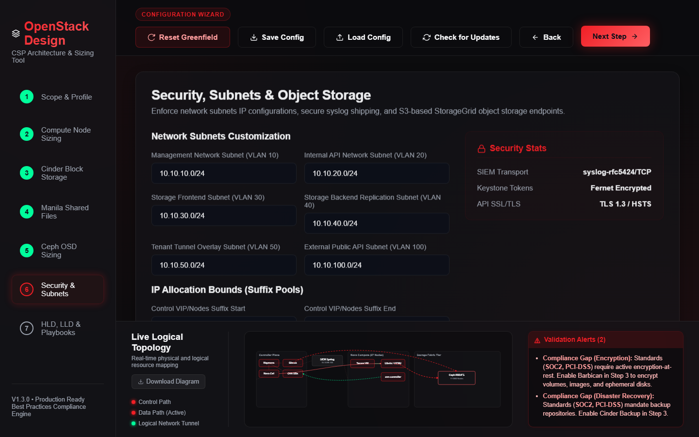
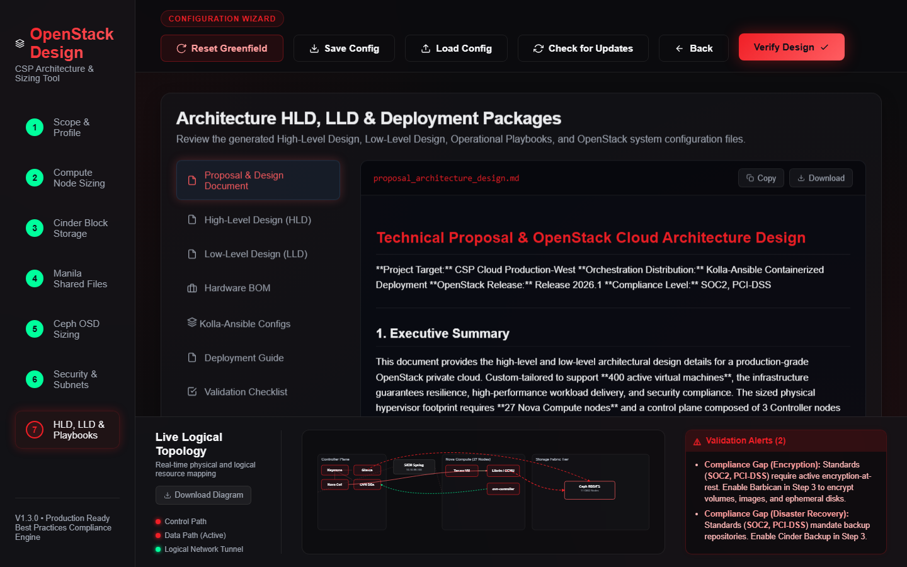

# OpenStack Sizing, Compliance & Design Configurator

An interactive, single-page web wizard for system architects and cloud engineers who need to plan, size, and validate an OpenStack private cloud before a single physical host is racked. It turns a handful of business inputs — expected VM count, storage capacity targets, an industry/compliance profile — into a fully-worked capacity plan, a live logical topology diagram, and a complete set of deployment-ready deliverables: a technical proposal, HLD/LLD design documents, Ansible/Juju/RHOSP templates, and every OpenStack service `.conf` file the deployment needs.

It runs entirely in the browser. There is no backend, no database, and no installation step beyond opening an HTML file — by design, so it can be used on an air-gapped laptop inside a customer's secure facility with zero network dependency.

---

## Table of Contents

- [Who this is for](#who-this-is-for)
- [Key Features](#-key-features)
- [Walkthrough: the 7-step wizard](#-walkthrough-the-7-step-wizard)
- [Storage backend support](#-storage-backend-support)
- [Compliance profiles](#-compliance-profiles)
- [Use cases](#-use-cases)
- [Detailed Documentation](#-detailed-documentation)
- [Project Architecture](#-project-architecture)
- [Usage Guidelines](#%EF%B8%8F-usage-guidelines)
- [Frequently Asked Questions](#-frequently-asked-questions)
- [Ownership, Intellectual Property & Legal Terms](#%EF%B8%8F-ownership-intellectual-property--legal-terms)

---

## Who this is for

- **Solutions architects** scoping a private/sovereign cloud build for a customer proposal, who need defensible node counts and a topology diagram before the SOW is signed.
- **Cloud engineers** planning a Kolla-Ansible, Canonical Charmed OpenStack, or Red Hat OpenStack Services on OpenShift (RHOSO) deployment, who want the inventory, `globals.yml`, `bundle.yaml`, or Custom Resource generated from a single source of truth instead of hand-typed three times.
- **Compliance/security reviewers** who need to see, in real time, whether a proposed sizing profile satisfies (or violates) SOC 2, PCI-DSS, HIPAA, GDPR, or Middle East sovereign cloud controls (Saudi NCA CCC, Dubai DESC CSP, UAE NESA/IAR-IAS) before it reaches a design review.
- **Storage engineers** deciding between Ceph, NetApp ONTAP, Dell EMC PowerFlex, Pure Storage FlashArray, HPE Alletra/Primera/3PAR, Dell PowerStore/PowerMax, or VAST Data as the Cinder/Manila backend, who want real driver names, protocols, and ports — not marketing copy.

---

## 🚀 Key Features

* **Interactive 7-step configuration wizard** — scope & compliance profile, compute sizing, Cinder block storage, Manila shared file systems, Ceph OSD sizing, network/security/subnets, and a final review step that renders every generated document.
* **Broad storage backend support** — Ceph RBD, NetApp ONTAP, Dell EMC PowerFlex, Pure Storage FlashArray, HPE Alletra/Primera/3PAR, Dell PowerStore/PowerMax, and VAST Data (Cinder block **and** Manila NFS) as selectable Cinder/Manila backends, each with real upstream driver class names, supported protocols, and management/data ports — see [Storage Backend Reference](docs/storage_backends.md).
* **Real-time capacity sizing engine**:
  - Compute & hypervisor limits (vCPUs, RAM, local/ephemeral disk), including optional Kubernetes worker/master overhead.
  - Dynamic CPU/RAM overcommit evaluation against the active compliance profile's thresholds.
  - Ceph capacity forecasting: raw capacity, OSD count, node count, and per-pool Placement Group (PG) allocation.
  - Network fabric sizing: total switch ports, recommended switch port headroom, and storage/overlay fabric bandwidth.
  - HA buffer planning and automatic IP-range/subnet expansion when sized node counts outgrow the configured address pools.
* **Live logical topology diagram** — a dynamic, responsive SVG rendering of the control plane, compute plane, and storage fabric tier, redrawn on every input change with real data-path and control-path connections. See [example diagrams](docs/images/).
* **Sovereign and enterprise compliance validation**, checked live as you type:
  - **SOC 2 Type II**, **PCI-DSS v4.0.1**
  - **HIPAA**, **GDPR** (with EU Data Act context)
  - **Saudi NCA CCC** (Cloud Cybersecurity Controls, CCC-2:2024)
  - **Dubai DESC CSP** (Cloud Security Provider Regulation, layered on ISR v3.0)
  - **UAE NESA/IAR-IAS v2**
  
  See the full mapping in [Compliance & Validation Engine](docs/compliance.md).
* **Save/Load configuration state** — export the entire input set to a `.json` file and reload it instantly to resume or share a sizing session.
* **Automated exporters** — generates a technical proposal, High-Level Design (HLD), Low-Level Design (LLD), a **Hardware Bill of Materials**, a **Staging Validation & Go-Live Checklist**, and deployment-ready `nova.conf`, `neutron.conf`, `keystone.conf`, `glance.conf`, `cinder.conf`, `manila.conf`, `ceph.conf`, an rsyslog SIEM config, plus Kolla-Ansible inventory/`globals.yml`, a Juju `bundle.yaml`, RHOSP/RHOSO templates, and Kubernetes Cinder-CSI/cloud-config/Velero manifests.
* **Hardware Bill of Materials** — turns the sizing engine's output into a procurement-ready spec: node counts, per-tier CPU/RAM/disk specs, external storage array capacity per vendor, and network switch port/bandwidth requirements — the same numbers as the Proposal document, in a form that leaves the architect's hands and goes to a hardware vendor.
* **Staging Validation & Go-Live Checklist** — a backend-aware test plan (not a generic OpenStack checklist) that only lists tests relevant to what you actually selected: a Ceph OSD failure drill only appears if Ceph is in use, a VAST Data NVMe-oF path failure test only if VAST is selected, a Velero restore test only if K8s+Velero is enabled, and so on — with explicit **Gap** items when a compliance-relevant control (Barbican, Cinder Backup) isn't yet configured.
* **Downloadable topology diagram** — the live logical topology SVG can be exported as a standalone, self-contained `.svg` file directly from Step 1/2's diagram panel, for dropping into a proposal deck or architecture doc.
* **Offline compilability** — packaged by `bundle.py` into a single, fully-inlined standalone HTML page for air-gapped secure enterprise zones. No CDN calls, no web fonts fetched over the network, no telemetry.
* **Check for Updates** — an in-app, user-triggered reference panel (never a background/scheduled network call from inside the tool itself) showing bundled OpenStack release, Red Hat OpenStack, Ceph, and compliance-standard version data, with an optional online refresh. For dark-site environments, the companion [check_for_updates.py](check_for_updates.py) script refreshes `data/versions.json` on demand or on a schedule (cron / Task Scheduler) from a machine with internet access.

---

## 📸 Walkthrough: the 7-step wizard

> A note on the images below: every screenshot in this section is the tool's actual rendered output, captured directly from a live session with the tool's own default input set (the Financial Services profile also used throughout [docs/sizing_engine.md](docs/sizing_engine.md)) — not a mockup. The topology diagrams elsewhere in this README are likewise the tool's **actual generated SVG output**, saved as real files under [`docs/images/`](docs/images/).

### Step 1 — Cloud Service Provider Profile

Set a project name, choose an **OpenStack Distribution** (Kolla-Ansible, Canonical Charmed OpenStack, or Red Hat OpenStack Services on OpenShift), an **OpenStack Version**, a **Planned Deployment Scale**, and a **Vertical/Industry Profile**. Picking an industry profile auto-selects a sensible starting compliance checklist and CPU/RAM overcommit target — see [Compliance profiles](#-compliance-profiles) below for exactly what each one sets. A live **Validation Alerts** panel and a compact logical topology preview update immediately as you type.



### Step 2 — Compute & Hypervisor Sizing

Enter target workload specs (VM count, vCPUs/VM, RAM/VM, ephemeral disk/VM), overcommit ratios, and physical node specs (cores, RAM, local disk per node), plus an N+X HA compute buffer. Optionally enable a Kubernetes VM sizing overlay (master/worker counts, per-node vCPU/RAM/disk, CNI, CSI driver, Velero backup). The sidebar shows live **Hypervisor Results**: total vCPUs/RAM requested, nodes required for CPU, nodes required for RAM, nodes required for local disk (only shown when it's the binding constraint), and the final HA-buffered node count.



### Step 3 — Cinder Block Storage Integration

Set total usable volume capacity, then select one or more Cinder backends from seven real vendor options (see [Storage Backend Reference](docs/storage_backends.md)). Each backend reveals its own parameter group (management IP, protocol, platform variant) and an interactive data-flow diagram. Below that: Cinder Volume Backup (target: StorageGrid S3 or a dedicated Ceph pool), Volume Encryption via Barbican KMS, Cinder DR Volume Replication, Multi-Attach, and QoS throttling.



### Step 4 — Manila Shared File Systems

Choose the DHSS (Driver Handles Share Servers) mode with a side-by-side comparison of the tradeoffs, then select one or more Manila backends (CephFS Native, CephFS via NFS-Ganesha, NetApp ONTAP, or VAST Data). The wizard actively validates DHSS/backend compatibility — CephFS and VAST's Manila driver only support `DHSS=False` — and blocks progress with an explicit, visible warning (not a silently-disabled button) until the conflict is resolved.



### Step 5 — Ceph Cluster Sizing & PG Allocation

Set individual disk size, OSDs per host, media type, replication factor, Glance image pool size, safety utilization limit, and a storage growth buffer. The sidebar computes total usable/raw capacity, minimum OSD disk count, dedicated storage node count, and target PGs for the Cinder volumes pool, using the formula `(OSDs × 100) / Replica Factor`, rounded up to the nearest power of two.



### Step 6 — Security, Subnets & Object Storage

Customize the six network subnets (Management, Internal API, Storage Frontend, Storage Backend/Replication, Tenant Overlay, External API), IP suffix pools for controller/compute/Ceph node ranges, SIEM/rsyslog target, network link speed, NetApp StorageGrid S3 object storage (auto-activated when needed by Glance/backup/Velero), and Neutron backend driver (OVN or ML2/OVS). A **Network Fabric Stats** panel shows total/recommended switch ports and storage/overlay fabric bandwidth, computed from the sized node counts.



### Step 7 — HLD, LLD & Deployment Playbooks

The final step renders every generated deliverable in tabs: Proposal & Design Document, HLD, LLD, a **Hardware Bill of Materials**, distribution-specific deployment templates (Kolla-Ansible configs, Juju Bundle, or RHOSP templates), Kubernetes manifests (when K8s is enabled), a Deployment Guide, a **Staging Validation & Go-Live Checklist**, and every OpenStack service `.conf` file. Each tab has **Copy** and **Download** buttons. The Bill of Materials and Validation Checklist are both generated fresh from whatever backends/features are actually selected — they're not static templates.



---

## 🗄️ Storage backend support

Seven Cinder/Manila backends are supported end to end — selectable in the UI, sized in the capacity engine, and reflected in every generated document (proposal, HLD/LLD, `.conf` files, Ansible/RHOSP/Juju templates):

| Backend | Cinder (block) | Manila (file) | Protocols |
|---|---|---|---|
| Ceph RBD | Yes | Yes (CephFS Native / NFS-Ganesha) | librbd (RADOS), CephFS |
| NetApp ONTAP | Yes | Yes | iSCSI, NFS |
| Dell EMC PowerFlex | Yes | — | SDC (proprietary) |
| Pure Storage FlashArray | Yes | — (FlashBlade only, not modeled here) | iSCSI, FC, NVMe-oF/RoCE, NVMe-oF/TCP |
| HPE Alletra / Primera / 3PAR | Yes | — | Fibre Channel, iSCSI |
| Dell PowerStore / PowerMax | Yes | — | iSCSI, FC, NVMe-TCP |
| VAST Data | Yes | Yes | NVMe-oF/TCP (block), NFS (file) |

VAST Data is the only backend besides Ceph with both an official upstream Cinder block driver and an official Manila file driver — worth knowing when a design calls for one storage vendor across both block and file. Full driver class names, ports, and example `.conf` output for every backend live in [docs/storage_backends.md](docs/storage_backends.md).

---

## 🛡️ Compliance profiles

Selecting a **Vertical/Industry Profile** in Step 1 auto-configures a starting compliance checklist and overcommit targets (you can still adjust either afterward):

| Industry Profile | Compliance checklist set | CPU Overcommit | RAM Overcommit |
|---|---|---|---|
| General Purpose CSP | *(none forced)* | *(unchanged)* | *(unchanged)* |
| Financial Services | SOC 2, PCI-DSS | 3:1 | 1:1 |
| Healthcare & Life Sciences | HIPAA, GDPR | 4:1 | 1:1 |
| Telecom NFV | UAE NESA/IAR-IAS | 4:1 | 1:1 |
| Sovereign Gov Cloud | Saudi NCA CCC, Dubai DESC CSP | 2:1 | 1:1 |

Every checked standard adds live, specific validation rules — overcommit ceilings, encryption-at-rest requirements, backup/DR mandates, Ceph replica-factor floors — enforced the moment you change an input, not after you generate a document. See [docs/compliance.md](docs/compliance.md) for the full rule set and [docs/use_cases.md](docs/use_cases.md) for worked examples of each profile.

---

## 📋 Use cases

Five worked, end-to-end scenarios — real sizing numbers, real generated warnings, and what each profile actually configures differently — live in **[docs/use_cases.md](docs/use_cases.md)**:

1. **Financial Services private cloud** — the tool's own default profile: 400 VMs, Ceph-backed, SOC2/PCI-DSS.
2. **Healthcare & Life Sciences** — HIPAA/GDPR isolation, encryption-at-rest requirements.
3. **Telecom NFV edge platform** — NESA/IAR-IAS high-availability and zero packet-drop tuning.
4. **Sovereign Government Cloud** — Saudi NCA CCC + Dubai DESC CSP, 1:1 resource sizing, and the DHSS=True/CephFS conflict the wizard catches automatically.
5. **Multi-vendor storage design** — combining Ceph, NetApp, Pure Storage, and VAST Data behind one Cinder backend selection, with Kubernetes enabled.

---

## 📖 Detailed Documentation

To explore specific architecture and calculation topics in detail, see the structured guides in the `docs/` directory:

* 🧮 **[Sizing & Capacity Engine](docs/sizing_engine.md)** — the mathematical models behind compute node counts, Ceph OSD/PG allocation, and network bandwidth, with worked numeric examples using the tool's own default inputs.
* 🏗️ **[Software Architecture & SVG Pipeline](docs/architecture.md)** — the glassmorphic design system (CSS), state synchronization flow (JS), dynamic vector rendering of the logical topology, and the version/compliance reference manifest.
* 🛡️ **[Sovereign Compliance & Validation Engine](docs/compliance.md)** — in-depth criteria for every supported standard and the real-time overcommit/encryption/backup warning bounds.
* 🗄️ **[Storage Backend Reference](docs/storage_backends.md)** — driver classes, protocols, ports, and example generated config for all seven Cinder/Manila backends.
* 🚀 **[Production Deployment & Setup Guides](docs/deployment.md)** — step-by-step installation guidelines for Kolla-Ansible, Canonical Charmed OpenStack (and the newer Sunbeam path), and Red Hat OpenStack Services on OpenShift (RHOSO) 18.0.
* 📋 **[Use Cases & Worked Examples](docs/use_cases.md)** — five end-to-end sizing scenarios with real numbers and generated output.

---

## 📁 Project Architecture

* **[index.html](index.html)** — Modular, responsive interface styled with glassmorphism and an integrated SVG dashboard.
* **[style.css](style.css)** — Vanilla CSS design system: theme variables, typography, layouts, and responsive queries.
* **[js/app.js](js/app.js)** — State coordinator, event handlers, Greenfield reset logic, DOM sync managers, and the version-manifest/Check for Updates panel.
* **[js/calculator.js](js/calculator.js)** — Sizing logic for compute nodes, Ceph storage pools, network fabric, and IP allocations.
* **[js/templates.js](js/templates.js)** — Generates every deliverable document: proposal, HLD/LLD, deployment templates, and service `.conf` files.
* **[bundle.py](bundle.py)** — Python compilation script that inlines all styles, scripts, and the version manifest into one standalone HTML file.
* **[data/versions.json](data/versions.json)** — Version/compliance/storage-driver reference manifest, shown by the "Check for Updates" panel.
* **[check_for_updates.py](check_for_updates.py)** — Companion script to refresh `data/versions.json` from a machine with internet access, on demand or on a schedule.
* **[docs/](docs/)** — Architecture, compliance, storage backend, deployment, sizing-engine, and use-case documentation (this folder).

---

## 🛠️ Usage Guidelines

### 1. Run the modular app locally

Start a local HTTP server in the project root to load modular JS files securely (avoiding CORS blockades on local files):

```bash
# Python
python -m http.server 8000

# Node.js
npx http-server -p 8000
```

Then open `http://localhost:8000` in your browser.

### 2. Standalone single-file compilation

To compile the entire app (HTML + CSS + JS + version manifest) into a single standalone HTML page for air-gapped systems, run the bundler:

```bash
python bundle.py
```

This builds [openstack_design_tool_standalone.html](openstack_design_tool_standalone.html) in the root folder, which opens directly by double-clicking on any machine — no server, no network access required.

### 3. Save & Load Configuration

- Click **Save Config** in the header to download a JSON file of your current configuration parameters.
- Click **Load Config** in the header and select your JSON config file to restore the session exactly where you left off.

### 4. Check for Updates

- Click **Check for Updates** in the header to view the bundled OpenStack/RHOSP/Ceph/compliance/storage-driver reference data and, optionally, fetch a fresher copy from the online manifest (only when you click "Check Online for Updates" — the tool never does this automatically, preserving the dark-site guarantee).
- For dark-site environments, run `python check_for_updates.py` on a machine with internet access to refresh `data/versions.json`, then copy that file into the air-gapped environment (or re-run `python bundle.py` to bake it into the standalone build). See the script's header comment for Task Scheduler / cron examples to run it on a recurring cadence.

### 5. A typical end-to-end session

1. Open the tool, set your project name and pick an OpenStack Distribution and Industry Profile in Step 1.
2. Walk through Steps 2–6, adjusting compute, storage, and network parameters. Watch the **Validation Alerts** panel — it updates live and tells you exactly what to fix.
3. On Step 7, review the Proposal & Design Document first (it's the executive-readable summary), then the HLD/LLD for architectural detail, then the distribution-specific deployment templates and `.conf` files.
4. Click **Save Config** to keep the input set for later, or **Download** individual deliverables as you need them.
5. Hand the Proposal document and deployment templates to whoever is executing the build — they're written to be handed off, not just read by the person who generated them.

---

## ❓ Frequently Asked Questions

**Does this tool ever send my configuration anywhere?**
No. Every calculation, every generated document, and the live topology diagram are computed entirely client-side in your browser. The only network call the tool can ever make is the explicit, user-triggered "Check Online for Updates" button in the Check for Updates panel — it fetches a public read-only version manifest and nothing else, and only when you click it.

**Can I use this without internet access?**
Yes — that's the primary design goal. Open [openstack_design_tool_standalone.html](openstack_design_tool_standalone.html) directly (double-click, no server) on a fully air-gapped machine. Every font, icon, and script is inlined; nothing is fetched from a CDN.

**Are the sizing numbers production-grade guarantees?**
No — they're planning-stage estimates. See the [Sizing & Sizing Outputs Disclaimer](#5-sizing--sizing-outputs-disclaimer) below. Always validate in a staging environment before a production cutover.

**Why do some storage backends only support Cinder and not Manila?**
Because that reflects the real OpenStack driver ecosystem, not a limitation of this tool. Pure Storage's official Manila support targets its separate FlashBlade platform, not FlashArray; HPE and Dell PowerStore/PowerMax have no confirmed official Manila driver at the time this tool's data was last verified. See [docs/storage_backends.md](docs/storage_backends.md) for the sourced detail per vendor.

**What happens if I select a Manila backend that doesn't support my DHSS setting?**
The wizard blocks progress on Step 4 with a specific, visible warning explaining exactly which backend is incompatible and what to change — it never silently disables the Next button without telling you why.

**How current is the version/compliance data?**
Click **Check for Updates** in the header to see the exact date the bundled data was last verified, plus an optional online refresh. See [Check for Updates](#4-check-for-updates) above.

---

## ⚖️ Ownership, Intellectual Property & Legal Terms

Copyright © 2026 Eugene Beauzec. All Rights Reserved.

### 1. Ownership & Intellectual Property Rights
This software application (the "OpenStack Sizing, Compliance & Design Configurator", hereinafter "Software"), including without limitation its source code, object code, HTML, CSS, JavaScript modules, calculators, templates, documentation, technical specifications, architecture, designs, workflows, configurations, prompts, scripts, build materials, databases, user interfaces, and all related materials, content and developments, whether existing now or created in the future, is the sole and exclusive intellectual property of Eugene Beauzec.

All rights, title and interest in and to the Software, including all copyright, economic rights, moral rights to the extent applicable, neighbouring rights, database rights, know-how, trade secrets, inventions, improvements, derivative works, updates, enhancements and all other intellectual property rights, are and shall remain exclusively vested in Eugene Beauzec, unless expressly transferred by him under a separate written agreement signed by him. All rights not expressly granted in writing by Eugene Beauzec are strictly reserved.

### 2. Independent Development Statement
The Software was independently conceived, authored, developed, tested and assembled by Eugene Beauzec on his own time and using independent tools, resources and development environments. The Software was not created as a work-for-hire, commissioned work, employment deliverable, client assignment, internal project, sponsored project, or contractual obligation for any employer, former employer, client, sponsor, platform provider, user, contributor or third party.

No employer, former employer, client, sponsor, platform provider, user, contributor or third party shall acquire any ownership interest, licence, royalty, profit-share, assignment right, benefit, claim, control, or other right in or to the Software by reason of Eugene Beauzec’s past or present employment, sponsorship, administrative status, visa status, immigration status, professional relationship, access to the Software, use of the Software, feedback, contribution, or use of independent development tools.

The Software does not contain, incorporate, derive from, or rely upon any confidential information, proprietary material, customer data, trade secrets, private repositories, internal systems, credentials, unpublished documentation, business plans, source code, technical materials, employer-provided resources, or non-public information belonging to any employer, former employer, client, sponsor, platform provider, user, contributor or third party.

Any use of third-party tools, including generative-AI assisted development tools, was carried out solely as an independent development aid under Eugene Beauzec’s personal direction, review, testing, selection and control. No confidential, proprietary, customer, internal, employer-owned, client-owned, or trade-secret information of any employer, former employer, client, sponsor, platform provider, user, contributor or third party was submitted to, uploaded into, disclosed to, or used with such tools in connection with the development of the Software.

### 3. Usage & Restriction Terms
No person or entity may copy, reproduce, modify, adapt, translate, publish, distribute, commercialise, sublicense, sell, assign, transfer, pledge, reverse engineer, remove attribution from, or claim authorship or ownership of the Software, in whole or in part, except as expressly authorised in writing by Eugene Beauzec.

Any permitted use of the Software is subject to the licence terms expressly stated by Eugene Beauzec in the `LICENSE` file. Nothing in this notice shall be interpreted as granting any implied licence, ownership right, commercial right, assignment, waiver, consent, or permission beyond what is expressly granted in writing.

If any third-party proprietary material is credibly identified as having been inadvertently included in the Software, Eugene Beauzec reserves the right to remove, replace or remediate such material promptly, without admission of liability and without prejudice to his ownership of the remaining Software.

### 4. Compatibility & Interoperability Disclaimers
Any references to third-party products, services, companies, platforms, trademarks, technologies or tools (such as Red Hat, OpenStack, RHOSP, Ceph, Kubernetes, Calico, Cinder, NetApp, EMC, Vault, and others) are made solely for identification, compatibility, interoperability, technical, or documentation purposes. Such references do not imply any affiliation, sponsorship, endorsement, approval, authorisation, partnership, licence, or commercial relationship with the relevant third-party owner. All third-party trademarks, product names, company names and service names remain the property of their respective owners.

### 5. Sizing & Sizing Outputs Disclaimer
This Software is an architectural planning and sizing tool. Sizing calculations, capacity projections, and compliance checklists generated by this tool are estimates for planning purposes only and must be independently verified in a staging environment before any production deployment. The user assumes all risk and responsibility for the design, deployment, configuration, security, and operation of any infrastructure sized or configured using this Software.

### 6. Warranty & Liability Limitation (Indemnification)
THE SOFTWARE IS PROVIDED "AS IS", WITHOUT WARRANTY OF ANY KIND, EXPRESS OR IMPLIED, INCLUDING BUT NOT LIMITED TO THE WARRANTIES OF MERCHANTABILITY, FITNESS FOR A PARTICULAR PURPOSE AND NONINFRINGEMENT. IN NO EVENT SHALL THE AUTHOR (EUGENE BEAUZEC), COPYRIGHT HOLDERS, OR CONTRIBUTORS BE LIABLE FOR ANY DIRECT, INDIRECT, INCIDENTAL, SPECIAL, EXEMPLARY, OR CONSEQUENTIAL DAMAGES (INCLUDING, BUT NOT LIMITED TO, PROCUREMENT OF SUBSTITUTE GOODS OR SERVICES; LOSS OF USE, DATA, OR PROFITS; OR BUSINESS INTERRUPTION) HOWEVER CAUSED AND ON ANY THEORY OF LIABILITY, WHETHER IN CONTRACT, STRICT LIABILITY, OR TORT (INCLUDING NEGLIGENCE OR OTHERWISE) ARISING IN ANY WAY OUT OF THE USE, MISUSE, OR INABILITY TO USE THIS SOFTWARE, EVEN IF ADVISED OF THE POSSIBILITY OF SUCH DAMAGE.
