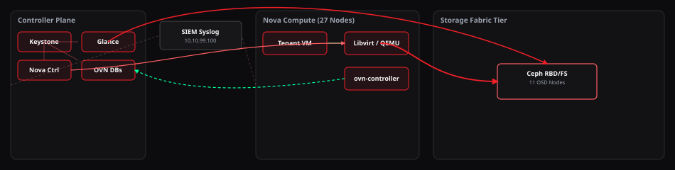
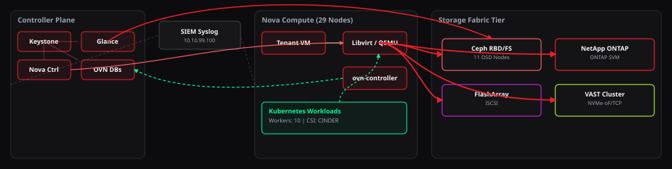

# Software Architecture & Layout Design

This document describes the design system, frontend architecture, and dynamic rendering pipeline of the OpenStack Sizing, Compliance & Design Configurator.

---

## 1. Design System & Styling (CSS)

The user interface follows a modern **glassmorphic dark-theme** aesthetic designed using vanilla CSS custom properties (variables) for theme alignment, responsive layouts, and interactions — no CSS framework, no build step.

### A. Theme Variables

Theme colors, border radii, and background configurations are controlled globally in [style.css](../style.css):

```css
:root {
  --bg-color: #0c0c0e;
  --glass-bg: rgba(22, 22, 25, 0.7);
  --glass-border: rgba(255, 255, 255, 0.08);
  --glass-border-focus: rgba(240, 31, 38, 0.45);

  --openstack-red: #f01f26;      /* primary accent, echoed throughout the UI */
  --accent-cyan: #f01f26;
  --accent-green: #00fe9c;       /* compliant / success state */
  --accent-yellow: #ffe066;      /* warning state */
  --accent-red: #ff5e62;

  --text-main: #f3f4f6;
  --text-muted: #9ca3af;

  --font-main: 'Outfit', sans-serif;
  --font-mono: 'Source Code Pro', monospace;
}
```

`'Outfit'`/`'Source Code Pro'` are first-preference fonts only — the stylesheet deliberately makes **no** `@import`/remote font fetch, since the standalone build ships to air-gapped environments. Both fonts fall back cleanly to system sans-serif/monospace with no network call either way.

### B. Responsive Structure

The application uses a hybrid **CSS Flexbox** and **CSS Grid** layout to support high-density sizing inputs alongside the logical topology dashboard. Under `1300px` viewports, the sidebar collapses and stacks above the main content. The header button row (`.wizard-nav-header` / `.wizard-nav-buttons`) uses `flex-wrap` so it degrades to multiple lines rather than overflowing the viewport at narrow widths.

**A layout gotcha worth knowing if you extend this UI:** any form field living inside a CSS grid or flex row (`.form-group` inside `.form-group-row`) needs `min-width: 0` explicitly — grid/flex items default to `min-width: auto`, which means a `<select>`'s longest option text can silently force the whole row wider than its container and overflow the page. This bit the OpenStack Version dropdown once (RHOSP's verbose deprecation-date labels triggered it); the fix is already applied globally on `.form-group` and the shared input/select rule, but keep it in mind if you add a new field with long dynamic text.

---

## 2. Stateful Frontend Pipeline (JS)

The application behaves as a reactive single-page app (SPA) driven by a central state object in [js/app.js](../js/app.js):

```javascript
const state = {
  currentStep: 1,
  currentTab: 'proposal_design',
  manifest: null,           // version/compliance reference data, see §4
  manifestSource: 'bundled',
  inputs: {
    projectName: 'CSP Cloud Production-West',
    openstackDistro: 'kolla',
    openstackVersion: '2026.1',
    // ... ~90 more sizing, storage, network, and compliance parameters
  },
  results: { compute: {}, ceph: {}, network: {} }
};
```

### A. State Synchronization Flow

Whenever a form control receives an input or selection change:

1. **Event interception** — the UI event listener extracts the input ID and updates `state.inputs[id]` (with a small ID→state-key remapping table for a handful of fields, e.g. `cinderNetAppIp` → `netappIp`, to avoid collisions between Cinder- and Manila-scoped vendor fields).
2. **Dynamic options evaluation** — if the distribution changes, `updateVersionOptions()` repopulates the available OpenStack release versions for that distribution.
3. **Sizing engine execution** — `calculateCompute()`, `calculateCeph()`, and `calculateNetwork()` run in sequence (see [docs/sizing_engine.md](sizing_engine.md) for the formulas). An auto-expand-subnet safety net runs afterward: if sized node counts have outgrown the configured IP suffix ranges, the ranges and subnet masks are widened automatically and a toast notifies you.
4. **Topology re-rendering** — `generateLiveTopologySVG()` recreates the SVG layout matching the updated node counts and active storage backends.
5. **Template generation** — on Step 7, the active tab's document is recompiled from the current `state.inputs`/`state.results`.
6. **UI refresh** — sub-panels, sizing-stat labels, compliance warnings, and the Step 4 DHSS/backend compatibility banner all update from the same pass.

### B. A note on validation gate scoping

A real lesson from this project's development: a validation gate's *visible explanation* and its *enforcement* must live on the same step. The Manila DHSS/backend compatibility check was once wired to run globally on every recalculation (to prevent a stepper-navigation shortcut around it), which meant selecting an incompatible industry profile on **Step 1** could silently disable the **Next** button with zero explanation visible anywhere on screen — the warning banner only exists inside the Step 4 panel. The fix: `goToStep()` now resyncs the gate specifically when entering or leaving Step 4, and the stepper-navigation shortcut is closed at the jump site instead — attempting to jump past an unresolved incompatibility redirects you to Step 4 with the warning visible and a toast explaining why, rather than leaving a control silently disabled somewhere else.

### C. The "parallel switch" pattern (and its failure mode)

Adding a new Cinder/Manila storage backend (or any similarly-enumerated concept) touches several functions that each maintain their own `if/else` or `.includes()` chain over the same set of backend keys: the UI card in `index.html`, the state defaults and diagram label maps in `app.js`, and — in `js/templates.js` — the `.conf` generator, the HLD/LLD backend-description helpers, the proposal-document vendor section, the Ansible/RHOSP/Juju template generators, and the live topology SVG's storage-tier builder. Each of these is logically independent, so adding a backend to one and forgetting a sibling function is the single most common bug class in this codebase's history. When adding anything new here, grep for every other place that switches on the same discriminator (`cinderBackends.includes(...)`, a `service === '...'` string, etc.) rather than assuming one change covers all call sites.

---

## 3. Dynamic SVG Topology Dashboard

The physical and logical system architecture is visualized dynamically in the bottom panel using vector graphics (SVG) generated programmatically inside `generateLiveTopologySVG(inputs, computeResult, cephResult)` in [js/templates.js](../js/templates.js). Two real examples, extracted directly from a live session (not mockups):

**Default sizing (Ceph RBD only, Financial Services profile):**



**Multi-vendor storage with Kubernetes enabled (Ceph + NetApp + Pure Storage FlashArray + VAST Data):**



* **Control Path Lines** — drawn as bezier paths connecting the Keystone/Nova/Neutron controller services to the compute plane.
* **Storage Data Paths** — one animated path per active Cinder/Glance backend, running from the compute plane's Libvirt/QEMU block into the Storage Fabric Tier.
* **Active Overlay Tunnels** — automatically shifts coloring and protocol names (Geneve vs. VXLAN) based on the active Neutron tunnel configuration.
* **Kubernetes Workload Overlay** — appears as an additional block inside the Compute Plane container when the K8s sizing overlay is enabled, with a dashed CSI mount path back to the compute node's Libvirt block.
* **Scaling beyond 4 storage blocks** — the layout has hand-tuned positions for 1–4 simultaneous storage-tier entries (Ceph, NetApp, PowerFlex, StorageGrid were the original four); with the addition of Pure, HPE, Dell PowerStore/PowerMax, and VAST Data, up to 8 backends can now be active simultaneously, so a generic grid-layout fallback (up to 4 columns × 2 rows) takes over for any 5th-and-beyond active backend rather than silently dropping it from the diagram.

---

## 4. Version & Compliance Reference Manifest

The **Check for Updates** header button opens a read-only reference panel (`#update-modal-overlay`) driven by a JSON manifest, loaded in priority order by `loadLocalManifest()`:

1. An embedded `<script id="version-manifest">` tag, present in the standalone build whenever `bundle.py` was last run with `data/versions.json` on disk — this is what a double-clicked, fully offline standalone HTML file actually uses.
2. A same-origin `fetch('./data/versions.json')` — works for the modular dev build served over `http://`, fails closed (silently, no error surfaced) under `file://`.
3. `EMBEDDED_MANIFEST`, a hardcoded fallback constant in `js/app.js`, used only if neither of the above is available.

The panel's "Check Online for Updates" button is the *only* network call this tool ever makes, and only fires on that explicit click — never automatically, never on a timer, preserving the dark-site/offline guarantee even for the modular dev build. The fetched manifest is treated strictly as inert JSON data (rendered through a shape-agnostic formatter, never evaluated as code) — see [check_for_updates.py](../check_for_updates.py) for the scheduled/offline-refresh counterpart that runs on a machine with actual internet access.

---

## 5. File map

| File | Responsibility |
|---|---|
| [index.html](../index.html) | DOM structure for all 7 wizard steps, the results tabs, and the Check for Updates modal |
| [style.css](../style.css) | The entire visual design system — no external stylesheet dependency |
| [js/app.js](../js/app.js) | State object, event wiring, step navigation, live validation, manifest loading |
| [js/calculator.js](../js/calculator.js) | Pure functions: `calculateCompute`, `calculateCeph`, `calculateNetwork` — see [docs/sizing_engine.md](sizing_engine.md) |
| [js/templates.js](../js/templates.js) | Every generated document: proposal, HLD, LLD, `.conf` files, Ansible/Juju/RHOSP templates, the topology SVG |
| [bundle.py](../bundle.py) | Inlines CSS, JS, and `data/versions.json` into one standalone HTML file |
| [data/versions.json](../data/versions.json) | The version/compliance/storage-driver manifest |
| [check_for_updates.py](../check_for_updates.py) | Refreshes `data/versions.json` from a machine with internet access |
